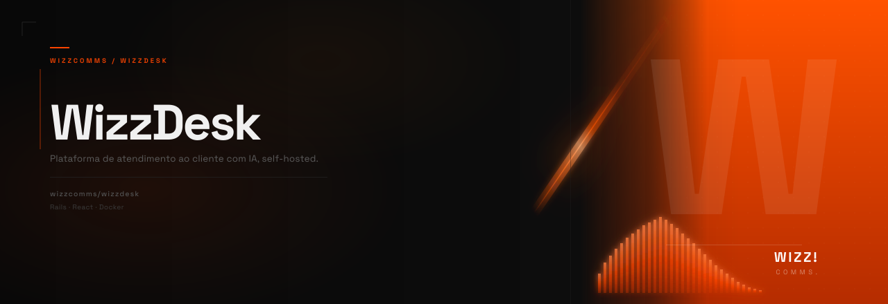

<p align="center">
  <a href="https://wizzcomms.com">
    
  </a>
</p>

<h1 align="center">WizzDesk</h1>

<p align="center">
  Open-source, single-tenant AI-powered customer support platform.
</p>

<p align="center">
  <a href="https://opensource.org/licenses/Apache-2.0"></a>
  <a href="https://docs.wizzcomms.com"></a>
  <a href="https://wizzcomms.com/community"></a>
</p>

<p align="center">
  <a href="https://wizzcomms.com">Website</a> &middot;
  <a href="https://docs.wizzcomms.com">Documentation</a> &middot;
  <a href="https://wizzcomms.com/community">Community</a> &middot;
  <a href="https://wizzcomms.com/contribute">Support the project</a>
</p>

---

WizzDesk is the open-source edition of the WizzDesk platform — a complete suite for AI-assisted customer support. It brings together authentication, CRM, AI agents, agent processing and a modern frontend into a unified, self-hostable stack.

This repository is the **monorepo entrypoint**: it aggregates all community services as Git submodules, giving you a single place to clone, update and orchestrate the entire platform.

---

## Architecture

The platform is composed of 6 independent services:

| Service                                                            | Role                                         | Stack                     | Default Port |
| ------------------------------------------------------------------ | -------------------------------------------- | ------------------------- | ------------ |
| [`evo-auth-service-community`](./evo-auth-service-community)       | Authentication, RBAC, OAuth2, token issuance | Ruby 3.4 / Rails 7.1      | `3001`       |
| [`evo-ai-crm-community`](./evo-ai-crm-community)                   | Conversations, contacts, inboxes, messaging  | Ruby 3.4 / Rails 7.1      | `3000`       |
| [`evo-ai-frontend-community`](./evo-ai-frontend-community)         | Web interface                                | React / TypeScript / Vite | `5173`       |
| [`evo-ai-processor-community`](./evo-ai-processor-community)       | AI agent execution, sessions, tools, MCP     | Python 3.10 / FastAPI     | `8000`       |
| [`evo-ai-core-service-community`](./evo-ai-core-service-community) | Agent management, API keys, folders          | Go / Gin                  | `5555`       |
| [`evo-bot-runtime`](./evo-bot-runtime)                              | Bot pipeline execution, debouncing, dispatch | Go / Gin                  | `8080`       |

### Design principles (Community Edition)

- **Single-tenant** — one account, no multi-tenancy overhead
- **No super-admin** — all configuration via seed data and environment variables
- **No billing / plans** — all limits removed, features unlocked by default
- **Role hierarchy**: `account_owner` and `agent` — no intermediate roles
- **Account resolution** via token — no `account-id` header required between services

---

## Getting started

### Prerequisites

- Docker & Docker Compose
- Git with submodule support

### 1. Clone with submodules

```bash
git clone --recurse-submodules git@github.com:agencywizz/wizzdesk.git
cd wizzdesk
```

If you already cloned without submodules:

```bash
git submodule update --init --recursive
```

### 2. Update all submodules to latest

```bash
git submodule update --remote --merge
```

### 3. Setup each service

Refer to each service's own README for environment configuration, setup and seed instructions:

- [evo-auth-service-community](https://github.com/EvolutionAPI/evo-auth-service-community#readme)
- [evo-ai-crm-community](https://github.com/EvolutionAPI/evo-ai-crm-community#readme)
- [evo-ai-frontend-community](https://github.com/EvolutionAPI/evo-ai-frontend-community#readme)
- [evo-ai-processor-community](https://github.com/EvolutionAPI/evo-ai-processor-community#readme)
- [evo-ai-core-service-community](https://github.com/EvolutionAPI/evo-ai-core-service-community#readme)
- [evo-bot-runtime](https://github.com/EvolutionAPI/evo-bot-runtime#readme)

> **Note:** `evo-auth-service-community` must be seeded before `evo-ai-crm-community` — the CRM depends on the user created by the auth seed.

For detailed setup instructions, visit the [full documentation](https://docs.wizzcomms.com).

---

## Service dependencies

```
evo-ai-frontend-community
    └── evo-auth-service-community  (authentication)
    └── evo-ai-crm-community        (conversations, contacts)
    └── evo-ai-core-service-community (agents, tools, API keys)
    └── evo-ai-processor-community  (agent execution, sessions)
        └── evo-bot-runtime         (bot pipeline execution)
```

All inter-service communication uses Bearer token authentication. The token issued by `evo-auth-service-community` is forwarded between services — no additional headers required.

---

## Submodules reference

| Submodule                       | Repository                                                                                                  |
| ------------------------------- | ----------------------------------------------------------------------------------------------------------- |
| `evo-auth-service-community`    | [EvolutionAPI/evo-auth-service-community](https://github.com/EvolutionAPI/evo-auth-service-community)       |
| `evo-ai-crm-community`          | [EvolutionAPI/evo-ai-crm-community](https://github.com/EvolutionAPI/evo-ai-crm-community)                   |
| `evo-ai-frontend-community`     | [EvolutionAPI/evo-ai-frontend-community](https://github.com/EvolutionAPI/evo-ai-frontend-community)         |
| `evo-ai-processor-community`    | [EvolutionAPI/evo-ai-processor-community](https://github.com/EvolutionAPI/evo-ai-processor-community)       |
| `evo-ai-core-service-community` | [EvolutionAPI/evo-ai-core-service-community](https://github.com/EvolutionAPI/evo-ai-core-service-community) |
| `evo-bot-runtime`               | [EvolutionAPI/evo-bot-runtime](https://github.com/EvolutionAPI/evo-bot-runtime)                             |

---

## Contributing

Contributions are welcome! Please open an issue or pull request in the relevant submodule repository.

Join the [community](https://wizzcomms.com/community) to discuss ideas, ask questions and collaborate.

Want to support the project? Visit [wizzcomms.com/contribute](https://wizzcomms.com/contribute).

## Built on Open Source

WizzDesk is built on top of [EVO CRM Community](https://github.com/EvolutionAPI/evo-crm-community) (EvolutionAPI) and [Chatwoot](https://github.com/chatwoot/chatwoot), which are open-source projects released under the Apache 2.0 licence. We are grateful to their contributors.

## License

Apache 2.0 — see [LICENSE](./LICENSE) for details.

Made with love by [Wizz! comms.](https://wizzcomms.com).
